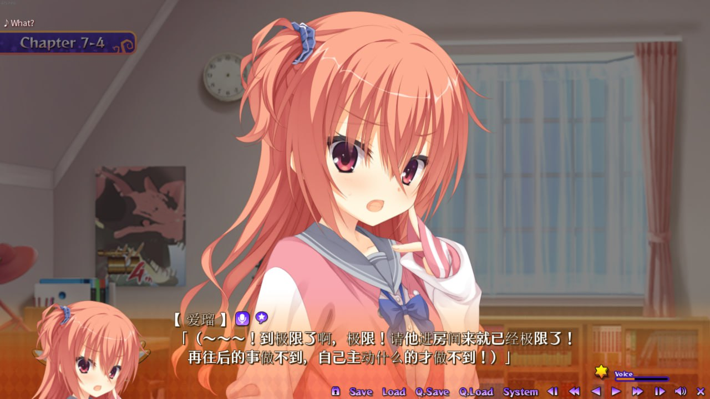

因幡めぐる为什么是神？ 在谈论这个问题之前，我想先说说其他女主相较于美咕噜究竟差在了哪里
<!--truncate-->

## 首先是犯下淫欲之罪的绫地宁宁
凭借正宫之名就露出不屑的笑，这种控制不住欲望的女主注定走不长远，事实也是如此，靠着一个阴险的0721赢了神之后一直在走下坡路，最终泯然众人。与之相比神就很谦卑，2-2的噗悠悠，2-3的趴桌，3-1的打怪猎贴贴，3-2的电影院牵手都是神留给凡人的慈悲，神不是不会进攻，只是不想通过太完美的表现让对手绝望所以故意不用，可笑有些人不理解神的良苦用心，竟然还用这些事来讥讽神，我劝你们好自为之。

## 然后是犯下愤怒之罪的三司绚濑
因为隔壁桌魔宴说rj的不好就跟人家打架，剧情中有人提到胸垫就怒气冲冲地使出自己的想愿能力，违背了神在《共通线》中的一句话：“我觉得女主就是要能很好的控制自己的情绪吧。”于是神降下了他的惩罚，绚濑暴露秘密，在原晓抢走胸垫和硅胶胸垫，更染上猫瘾一蹶不振。

## 接着是犯下懒惰之罪的椎叶紬
自以为成为魔女就了不起了，自创男装训练法。另外大家有所不知，其实在紬转到姬松学院前，紬闭上眼睛做冥想的时候，其脑海中看见的画面，正是站在光芒之中的美咕噜，那时神告诉他：“你只可到这里，不可越过。”然而，神的劝说不但没有让紬迷途知返，竟然还敢在cosplay大赛前暗中挑战神的威严，于是神降下了他的惩罚，紬在决赛身败名裂，成为了女三没人记得，从此成为了众人口中的紬妈妈。

## 再然后是犯下了嫉妒之罪的仮屋合奏
屡次被神击败，但口服心不负的合奏，暗中嫉妒着神，甚至胆敢当众质疑保科对神的爱称。于是，在含金量最高的女主人气排名上，合奏被神正面击溃。不过，念在合奏最终皈依了神的教，并且践行神的意志讨伐了屡次以下犯上的幢子后，神应许了她拥有独唱ed的权利。　

## 犯下贪婪之罪的朝武芳乃
只因是隔壁的女主，芳乃就成为了男主的未婚妻，而这，自然是因为神的应允。神本来钦定他为自己在千恋万花的代言人，在自己退役之后替自己继续讨伐萌二柚子厨，为此甚至不惜亲自为芳乃配音，在万圣节派对主动输掉cosplay大赛，将一切荣耀都归给他，甚至应允他可以带走自己最爱的男主。但最后芳乃却被爱情蒙蔽了双眼，不再以践行神的理想为自己的理想，也不再聆听神的教诲，甚至自以荣光已经超过了神，竟允许粉丝写出出“Ciallo～(∠・ω< )⌒☆”这种盗窃神萌点的颜文字，于是神降下了惩罚，芳乃从此不能生娃娃并且拥有祟神的诅咒，而他的将臣将再也不能拿起丛雨丸，他的保镖茉子也沉迷于0721，她的玉子烧再也不能放砂糖，她的田心屋也再不能向她贩卖甜食了。

## 犯下暴食之罪的周防恭平
在神女芳乃堕落之后，神开始寻找下一个代言人，这一次，他选中了恭平。相较于神，恭平无疑是不完美的，他没有神足以让对手窒息的可爱，也没有神的活泼，但神将自己的部分欧派暂时交给了他，但恭平不引以为傲，反而将神赐予的欧派抛弃去当男主的基友，神认为或许是自己给的压力过大才导致了恭平的堕落，于是这一次神选择成为女四，并赋名二条院羽月，和恭平平起平坐减少恭平的心理负担，最终，恭平成功了。然而，当成基友后的恭平不但每天带男主吃大份的饭菜，更妄图染指神力，只是他错误地认为神的力量来源于和男主一起吃便当，最终他也因此犯下了暴食之罪，并在rj无缘个人线。

## 最后，犯下傲慢之罪的星河かぐ耶
个人线之后，神已经非常虚弱了，二条院羽月吸走了神所有的可爱系配音，神已经无力再惩罚恭平，只有信徒依旧在维护神的威严而已。此刻已经决心退隐的神在最后依然心系柚子社，于是他选中了第四位神子——星河かぐ耶。作为第四任神子，星河かぐ耶很好地维护了神的威严，但在接连击溃两代堕落的神子后，星河かぐ耶遇到了淫魔遥空姐，被吸走了神赋予自己的力量，于是在新作中连连失误，最终葬送比赛，彻底身败名裂。

 
