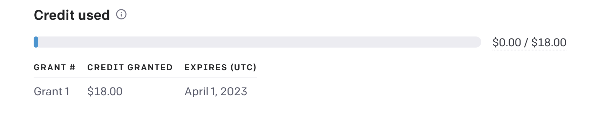
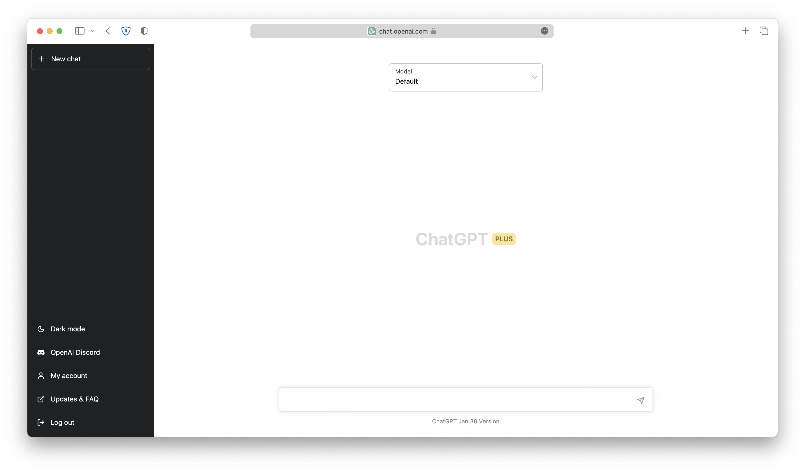
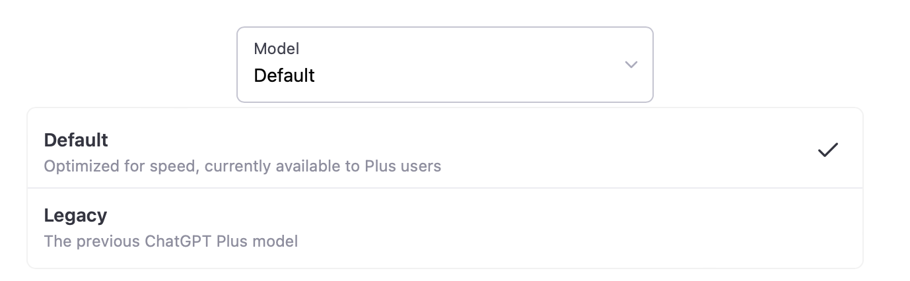
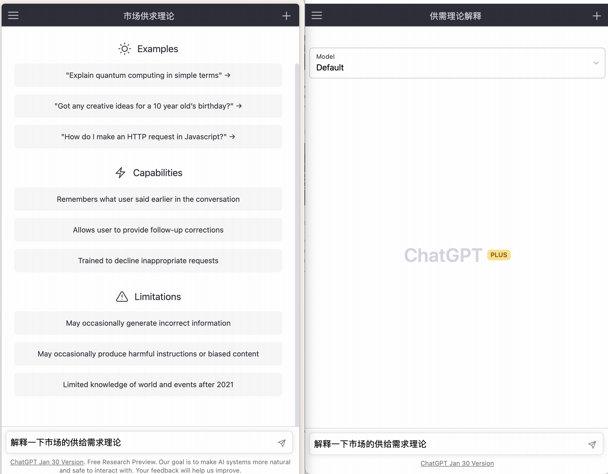

  
**TL;DR**: 不值得直接订阅。如确有需求可以考虑拼车
<!--truncate-->

在2023年2月1日，OpenAI 宣布推出 ChatGPT Plus 订阅服务。ChatGPT Plus 的订阅价格定在了 $ 20/月 （约合136元人民币），订阅者可以享受：高峰时段的优先访问权、更快速的响应时间和尝鲜未来的新功能。

需要注意的是，ChatGPT Plus订阅服务并不会提供额外的 OpenAI API 额度。Plus 订阅用户和免费用户一样，免费额度仍然是 $18。

## 实际使用体验

Plus 用户相比普通用户的界面多出了一个黄色的 Plus 标志，并且相比普通用户，提供了两种模型选择，分别是 Default（为速度优化）" 和 "Legacy（先前的Plus版本模型）"。  

:::info
Default 为原先的 `Turbo` 模型（alpha 版）
:::

在实际的体验中，Plus 版本的响应速度（默认模型）大概比普通版本快了30%左右。不过，我认为这个速度提升并不是非常明显，而且对于大部分用户来说，这个速度提升并不是非常必要的。（下图左边为普通版，右边为 Plus 版本  ~~普通版抢跑~~）

中文生成速度测试：

相比于文本生成速度，Plus 版本一个更加重要的改进是出现错误的次数大大减少。在使用普通版的过程中，经常会出现网络问题，需要重新刷新页面，丢失掉已经输入的内容。而Plus版本则较少出现过这种情况。

## 是否值得订阅？
对于大部分普通用户来说，ChatGPT Plus 并不建议。如果只是想尝试一下 ChatGPT，并没有必要追求 Plus 这一更快的生成速度。Plus 版本和普通版本的生成模型和内容是一样的，所以对于大部分用户来说，Plus 版本并没有什么特别的优势。并且$20/月的订阅支出也是不小的一笔开销。  

但是，ChatGPT Plus 提供了在高峰时期也能访问的功能。所以，如果 ChatGPT 在你的日常工作/学习流中已经成为了不可或缺的一部分，对你的生产力有很大提升，那么 Plus 版本可能会是一个不错的选择。不过，在这种情况下也能使用 OpenAI 的 [API](https://beta.openai.com)  来应急。

同时，拼车也是可以考虑的一个方案。OpenAI 官方目前并没有限制登录网页设备，也没有IP限制。我目前上的是一个4人车，大概35左右一个月。不过拼车的话需要注意，如果有多人同时发消息的话会显示让你等待消息发送完成以后才能进行消息发送（撞车）。不过如果3-4人拼车的话，撞车的问题也不是很常见。另外拼车的时候注意不要询问过于涉及隐私的内容，记得及时删除消息记录。  

## 总结
ChatGPT Plus 虽然确实相比普通版有一定的优势，但是其高昂的订阅价格，让很多用户望而却步。因为需要使用国际信用卡进行支付，国内用户目前订阅 ChatGPT Plus 还存在着一定门槛。  并且目前 Plus 版本并没有譬如联网功能这样的绝对优势。如果 OpenAI 可以在未来降低订阅价格，或者提供更多的独占功能，那么 ChatGPT Plus 就会成为一个非常不错的选择。

