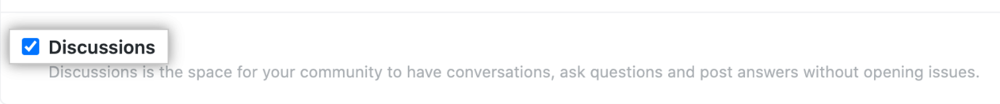

  
使用 Docusaurus 的 Swizzle 功能，向 Docusaurus 博客页面添加 Giscus 评论区
<!--truncate-->

## 原理
Docusaurus 官方并没有提供开箱即用的评论区组件，但是我们可以通过 [Swizzle](https://docusaurus.io/zh-CN/docs/swizzling) 功能来实现组件的自定义。

本文使用的评论系统是 [Giscus](https://giscus.app/zh-CN)，这是一款基于 GitHub Discussions 的开源评论系统。

## 创建 Giscus 配置
### 仓库配置
在 [GitHub](https://github.com/) 转到你 Docusaurus 网站的仓库页面，确保仓库已经公开。

如未公开，可以转到 Settings - General 最底部 Danger Zone - Change repository visibility。

确认仓库处于公开情况之后，在 Settings 的 Features 选项卡中勾选 Discussions


转到 [Giscus GitHub App 页面](https://github.com/apps/giscus)，按照提示安装。根据自身需求选择 Repository access 范围。
### 获取仓库API KEY
打开 [Giscus 官网](https://giscus.app/zh-CN)，输入自己的仓库地址  

  

在 “Discussion 分类”中选择“📣 Announcements”，剩下的选项可按需配置。
完成配置后，可以得到底部的配置文件。
```html
<script src="https://giscus.app/client.js"
        data-repo="your-name/your-repo"
        data-repo-id="your-repo-id"
        data-category="Announcements"
        data-category-id="your-category-id"
        data-mapping="pathname"
        data-strict="0"
        data-reactions-enabled="1"
        data-emit-metadata="0"
        data-input-position="bottom"
        data-theme="preferred_color_scheme"
        data-lang="zh-CN"
        crossorigin="anonymous"
        async>
</script>
```

## 通过 Swizzle 插入 Giscus 组件
首先在项目中安装 Giscus React 组件
```bash
npm i @giscus/react
```

在 `/src/components/`下创建 `GiscussComponents.js` 文件  

复制进以下代码，对应的id值可从上文的配置文件中寻找：
```js
// GiscussComponent.js
import React from 'react';
import Giscus from "@giscus/react";
import { useColorMode } from '@docusaurus/theme-common';

export default function GiscusComponent() {
    const { colorMode } = useColorMode();

    return (
        <Giscus
            repo="" //这里填写你的repo
            repoId="" //你的repo id
            category=" "//你的category（默认 Announcement）
            categoryId=""  //你的category id
            mapping="pathname"                                    		
            term="Welcome to @giscus/react component!"
            strict="0"
            reactionsEnabled="1"
            emitMetadata="1"
            inputPosition="top"
            theme={colorMode}
            lang="zh-CN"
            loading="lazy"
            crossorigin="anonymous"
            async
        />
    );
}
```
运行 Swizzle
```bash
npm run swizzle
```

选择你的主题配置文件（默认为 theme-classic)
```shell
> docusaurus swizzle

? Select a theme to swizzle: › - Use arrow-keys. Return to submit.
❯   @docusaurus/theme-classic
    @docusaurus/plugin-debug
    [Exit]

```

向下找到 `BlogPostItem`，回车确认
```shell
BlogListPage (Unsafe)
    BlogListPaginator (Unsafe)
❯   BlogPostItem (Unsafe)
    BlogPostItem/Container (Unsafe)
    BlogPostItem/Content (Unsafe)

```

回车选择  `Wrap` 和  `YES: I know what I am doing!`
```shell
? Which swizzle action do you want to do? › - Use arrow-keys. Return to submit.
❯   Wrap (Unsafe)
    Eject (Unsafe)
    [Exit]

```

打开 `/src/theme/BlogPostItem/index.js`，将内容修改为
```js
import React from 'react';
import { useBlogPost } from '@docusaurus/theme-common/internal'
import BlogPostItem from '@theme-original/BlogPostItem';
import GiscusComponent from '@site/src/components/GiscusComponent';
import useIsBrowser from '@docusaurus/useIsBrowser';

export default function BlogPostItemWrapper(props) {
  const { metadata } = useBlogPost()
  const isBrowser = useIsBrowser();

  const { frontMatter, slug, title } = metadata
  const { enableComments } = frontMatter

  // 防止 ReferenceError: window is not defined 错误 (https://docusaurus.io/docs/advanced/ssg)
  var isCurrentUrlBlog = false
  if (isBrowser) {
    isCurrentUrlBlog = window.location.pathname === "/blog"
  }

  return (
    <>
      <BlogPostItem {...props} />
      {(enableComments && !isCurrentUrlBlog) && (
        <GiscusComponent />
      )}
    </>
  );
}
```

接下来，在对应的 Blog 页面头部元数据中加入`enableComments: true`
例如：
```md
---
title: 一个标题
authors: 作者
tags: [标签]
enableComments: true 
---
```

:::info
如果重新运行 swizzle，组件会被还原，需要重新修改
:::