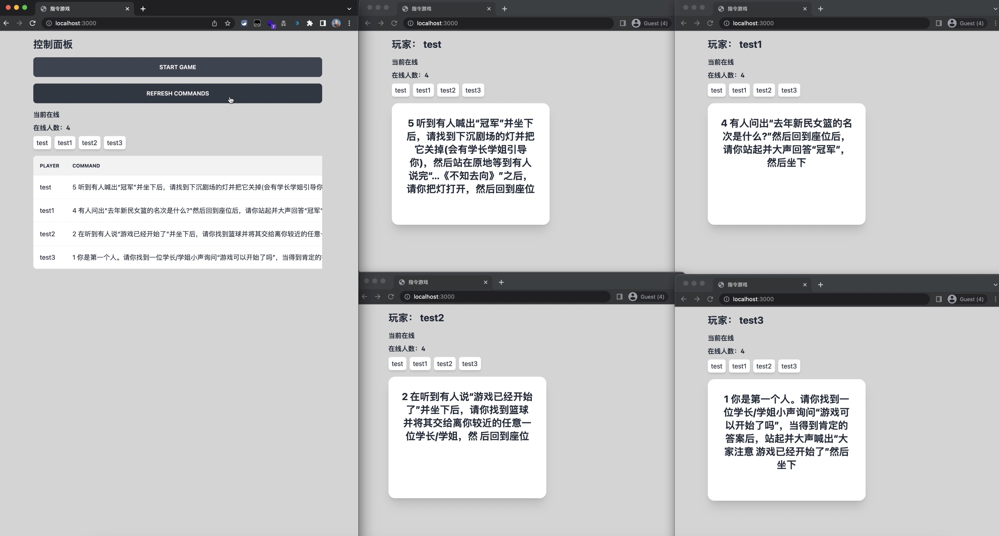
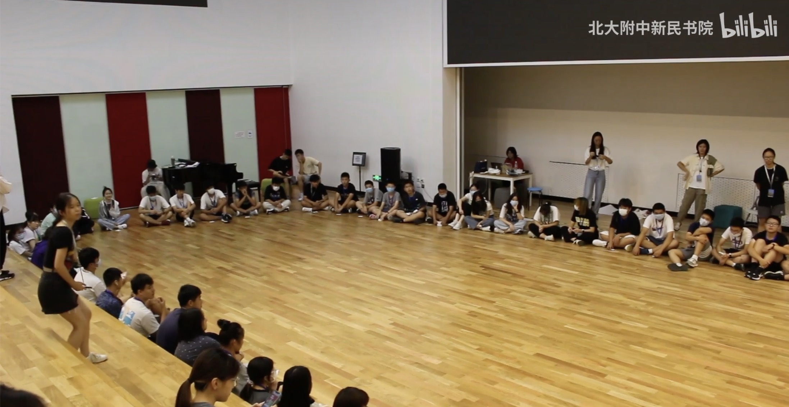
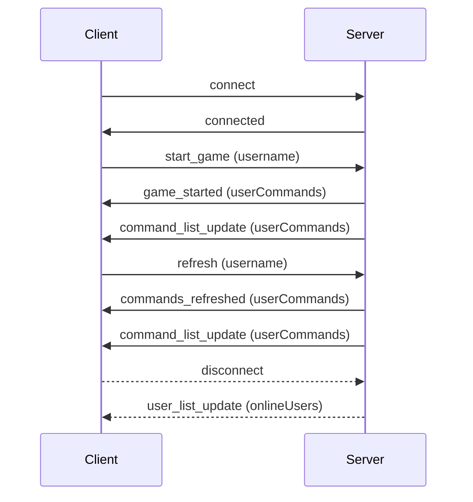

<!--truncate-->


## 前言
「指令游戏」是北大附中我所在的书院每年传统的入学教育保留项目。游戏规则很简单：
游戏开始时，主持人给每个参与者随机发放一张写着指令的卡片。所有人需要按顺序执行他们各自的指令，如果有人做错了，游戏就需要从头开始。
例如：
:::tip 卡片1

大声喊出“大家注意 游戏已经开始了”

:::

:::tip 卡片2

在听到“游戏已经开始了”后，找到灯并开关两次 然后回到座位

:::

:::tip 卡片3

当灯被开关两次后 邀请你左边第三个同学 一起在圈中跳3下 并带他一起回到座位

:::

听上去很简单，不是吗？一开始，所有人都是这么想的。但是，「做错了」的判定包含动作做错、顺序错误、没有衔接上（出现明显卡顿）、以及有人说话。

在「指令游戏」进行的过程中，会场十分安静，所有人都在注意着执行指令的同学。在这样的高压气氛下，一紧张难免会出现动作失误、忘记顺序等种种事故（尤其是有一条指令「说出你右边五个同学的名字）」。——而事实确实如此。在我参加「指令游戏」时，我们花了整整一个下午（4～5个小时），仅仅来完成一场游戏。而对于新一届同学来说，情况也并没有好转。

无法否认的是，「指令游戏」可以通过活动内容，让新生彼此之间更加熟悉、了解，具有趣味性。培养新生间的默契，尽快融入集体。锻炼集中精神、自我管控的能力，这一点在附中生活中非常重要。

> 附中的学习生活是十分独立自主，你收到的每一条通知都是十分重要的，所以我们希望通过这个游戏来让大家慢慢重视起来对于指令的执行能力和严谨性，在今后的校园生活中，你们所接收到的指令会是一项作业，一则通知又或是一次团队协作…如果因为粗心又或是大意，你很有可能会错过一次机会，一项成绩更甚至于别人给予你信任。所以在入学教育期间，身为学长学姐的我们希望通过这个游戏不仅仅让你们之间更加熟悉，默契也希望你们可以从活动中有所收获和反思，更好的迎接附中生活。——《活动策划案》



在实际的游戏过程中，我发现一大部分时间都浪费在了做错后，收回指令卡片并且重新发放的过程。在一个指令做错后，从学长学姐回收卡片-打乱-重新发放，这个过程大概要花费2-3分钟。在这反复的2-3分钟等待期间，参与者的耐心和热情逐渐被消耗，后期的压力也逐渐增大，同时整体的纪律也开始变得松散。这种焦虑的等待导致了”放弃”的情绪。

在等到游戏结束后，大多数参与者或许感到的更多是一种「解脱感」，实际上的「成就感」或者「集体荣誉感」可能并没有太被体现出来。

因此，我们是否能通过用户体验的设计思维来改进这个游戏？

**根据 Nielsen’s Law of User Interface Design， 用户的耐心在等待超过1秒后开始下降，超过10秒就可能完全失去。**因此，错误后的重置和指令的分发应尽快完成，以维持参与者的注意力和游戏的连续性。电子化游戏将是一个有效的解决方案。

通过电子设备分发指令，可以减少物理卡片收回和再发放的等待时间，让参与者将精力集中在执行指令上。此外，电子系统可以在错误发生后立即重置，不再需要等待时间，这样也能缓解参与者的焦虑感。

同时，设计一个友好的用户界面和交互模式，使得游戏规则和当前状态一目了然，提高了游戏的流畅性和可玩性。这样的设计，既保留了游戏的核心理念，又优化了游戏体验，有助于更好地激发参与者的热情，培养他们的团队协作精神和指令执行能力。

## 明确需求
根据上述游戏内容介绍，我们可以构建出需求：
- 服务器需要与客户端实时双向通信

- 需要区分管理员和玩家用户
- 在线用户展示
- 每次游戏开始，所有玩家会被随机分配到一张卡片
- 管理员可以下发游戏开始、游戏重置
- 玩家实名制
- 错误处理：对于意外断网情况有预案准备
- ……

## 系统构建
明确了需求之后，我们可以着手开始构建系统。

对于服务器双向通信，我采用了基于 WebSocket 的 Socket.IO 库。Socket.IO 具有事件驱动的架构，通过触发和监听事件，可以方便地实现服务器与客户端之间的消息传递和数据同步。我可以定义自己的事件和处理程序，以满足游戏的特定需求。Socket.IO 具有自动重连机制，当客户端与服务器的连接断开时，它会尝试自动重新建立连接。另外，Socket.IO 还提供了错误处理的机制，可供捕获和处理连接错误、超时和其他异常情况。



对于服务器后端，为了扩展性考虑，我选择了基于 Node.js 的 Express 框架。这样，一套系统可以被应用于Web Application、App，以及微信小程序。

程序的核心部分——分配命令和打乱的实施：
```js
function assignCommands(users, commands) {
  const shuffledCommands = shuffle([...commands]);
  return users.reduce((acc, user, idx) => {
    acc[user] = shuffledCommands[idx];
    return acc;
  }, {});
}

function shuffle(array) {
  for (let i = array.length - 1; i > 0; i--) {
    const j = Math.floor(Math.random() * (i + 1));
    [array[i], array[j]] = [array[j], array[i]];
  }
  return array;
}
```

用户列表与命令下发：
```js
//服务端
socket.on('start_game', (username) => {
    if (socket.isAdmin) {
      userCommands = assignCommands(users, commands);
      io.emit('game_started', userCommands);
      io.emit('command_list_update', userCommands);
    }
  });

  socket.on('refresh', (username) => {
    if (socket.isAdmin) {
      userCommands = assignCommands(users, commands);
      io.emit('commands_refreshed', userCommands);
      io.emit('command_list_update', userCommands);
    }
  });

  socket.on('disconnect', () => {
//从列表中删除断开连接的用户
    const index = onlineUsers.indexOf(socket.username);
    if (index !== -1) {
      onlineUsers.splice(index, 1);
      io.emit('user_list_update', onlineUsers);
    }
  });
});

//客户端
 socket.on('game_started', (userCommands) => {
          const command = userCommands[username];
          document.querySelector('#command').textContent = `${command}`;
        });

        socket.on('commands_refreshed', (userCommands) => {
          const command = userCommands[username];
          document.querySelector('#command').textContent = `${command}`;
        });

        socket.on('user_list_update', (userList) => {
          const list = document.querySelector('#user-list');
          list.innerHTML = '';
          userList.forEach((user) => {
            const div = document.createElement('div');
            div.textContent = user;
            list.appendChild(div);
          });
        });
```


## 成果展示
目前实现的功能
- 仅供在处于白名单内的玩家登录

- 管理员控制开始游戏、刷新指令 

- 在线玩家列表实时更新

- 所有玩家指令显示

- 用户鉴权验证：仅有管理员可以执行开始游戏、刷新指令操作
- 网络断开提示和自动重联


完整 Demo 演示：


TODO: 电子化「指令游戏」的一大主要问题是参与者在接触到电子设备后，可能会时不时切到微信以及其它应用。为了解决这个问题，可以参考问卷星等考试页面，使用 Event Listner 来检测切屏行为，并且施加警告。

TODO：在线用户跟踪。目前在线用户的数组存储在服务器内存中。这种方法在服务器重启或者横向扩展（多实例）的时候会丢失所有的数据。在一个更复杂的应用中，可能需要使用数据库或者中心化的存储方式（如Redis）来存储这些数据。
  
TODO：离线用户上报以及更加复杂的重联策略。包括
- 立即重连：在连接断开后，客户端应该尝试立即重新连接。如果这次重连失败了，客户端可以等待一段时间后再尝试。
- 退避策略（Backoff strategy）：如果连续的重连都失败了，客户端应该增加两次重连之间的间隔时间。间隔时间可以是固定的，也可以是逐步增加的，或者是一个随机的时间间隔。这样可以避免过度的重连请求压垮服务器，也可以给网络环境一些恢复的时间。
- 最大重连次数：客户端应该设置一个最大重连次数，当达到这个次数后，停止尝试并通知用户。

TODO：更加美观、游戏化的界面设计及交互

# 总结
虽然「指令游戏」是书院入学教育流传下来的传统，但其过于高压、冗长的游戏过程也被人诟病。通过电子化「指令游戏」，我希望改进游戏的流程和玩家体验，同时保留了游戏的核心理念和其在新生培训中的角色。
