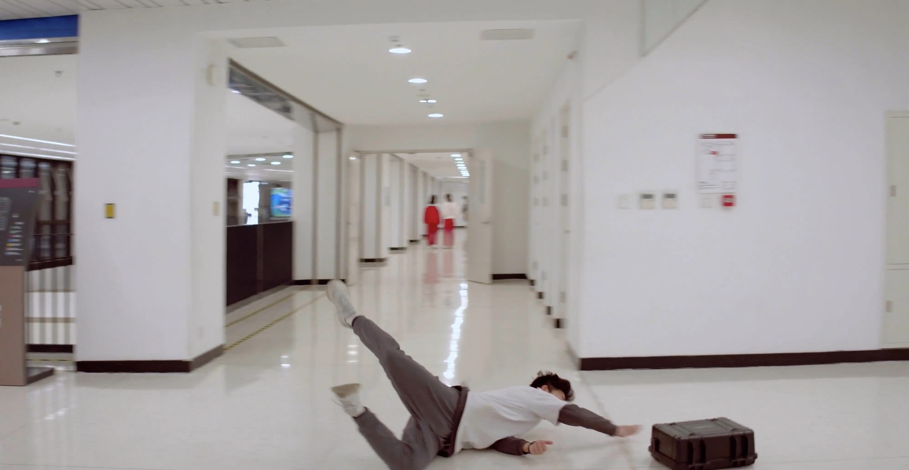
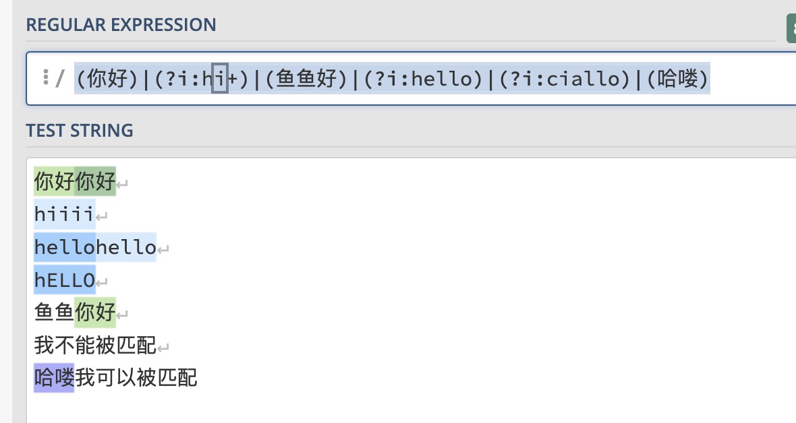
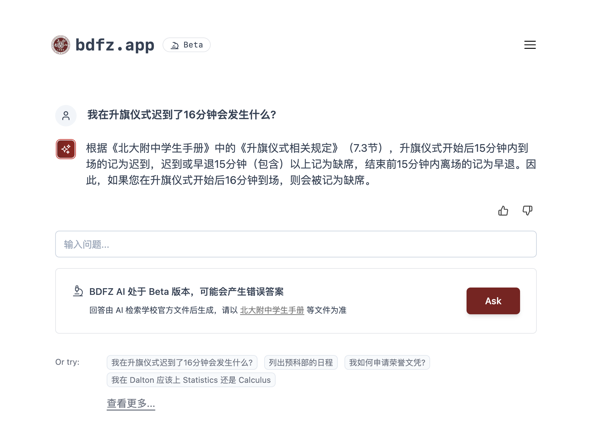
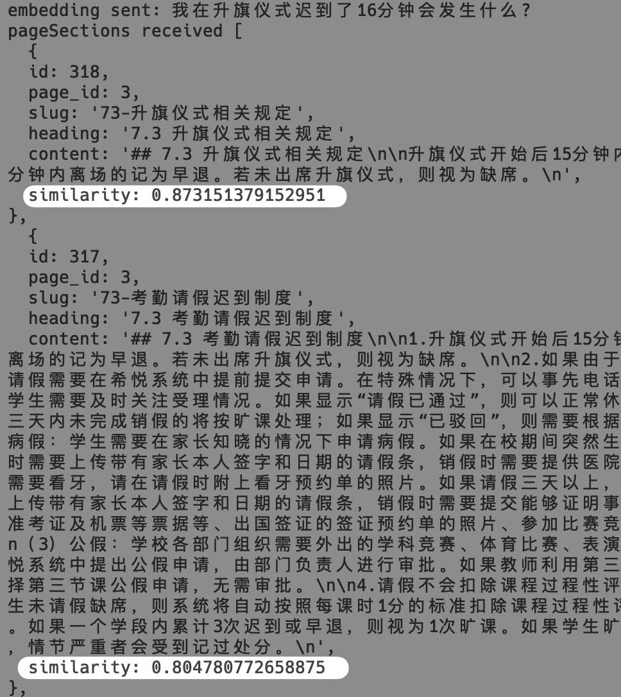
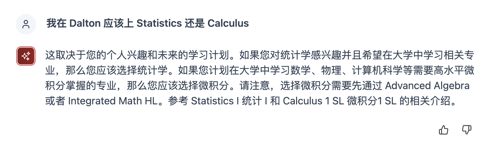
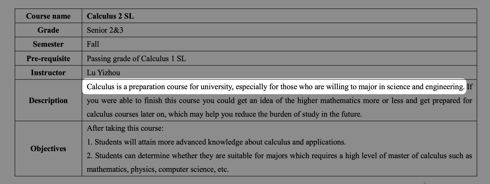
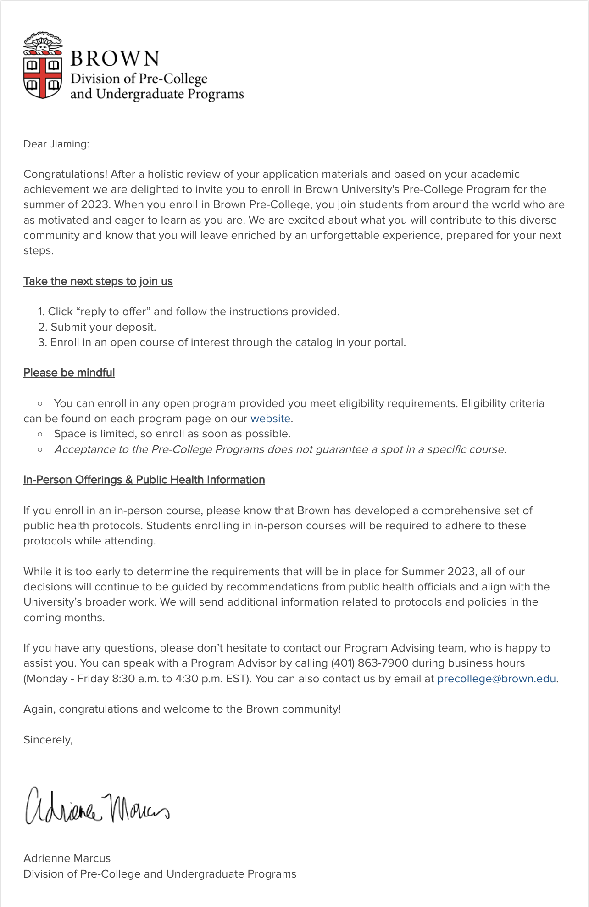

<!--truncate-->

## 引子
一年前，我的BBS问我：「你觉得如果我要去申请荣誉文凭的话，你怎么看？」，彼时的我，对于荣誉文凭的印象仅停留在刚入学回答 Rookie 选择题时查阅的资料。
一年后的今天，我收到了荣誉文凭申请开始的通知。时光荏苒，那些涌动在心底的情感和记忆，浮现在我的心头。
## 壹 · 社团｜锐思破镜，影启未界
在入学伊始，我加入了红砖社团。彼时的红砖，是一块独一无二的「砖」，它与微电影社团钢的琴唱出不同的旋律，它是「摄影」社团中纯粹的凝视者。然而，在静止的图像与流动的影片之间，存在着一种微妙的交织。红砖，虽以摄影的娴熟和精致赢得了校园的赞誉，却在影像创作的领域少有涉及。而我，在这缝隙之间，填充了它的不完整。

在彼时，我已拥有3-4年的视频创作经历，做过了大大小小的视频项目，也熟悉常见的工业级视频剪辑软件。我带领着红砖步入了影像创作的新领域。

从红砖内部的项目起步，「教师节红砖特别企划采访短片」「Neon Cafe 宣传片」这些短片如同初冬的雪花，飘落在社团的土壤上，我渐渐在社团中得到了认可。

在高一的夏季，北大附中一年一度的「足球杯」如期而至。那一年的足球杯，对红砖而言，是一次重大的挑战——我们接过了制作校级年度足球杯宣传片和纪录片的重任。而我，负责了这两部片子的剪辑工作。

在与团队成员讨论的过程中，我了解到了以往的宣传片的风格——大多都遵循同一种模板：固定的球场上训练镜头 ；采访一些同学表达展望，再以队员齐声加油鼓励，表达夺冠决心来结尾，配上热血的BGM，很美好，不是吗？没错。这样的宣传片确实是一份「标准答案」。但是问题是：观众已经「审美疲劳」了。年复一年都是「新瓶装旧酒」，这类视频虽然在现场气氛的煽动性表现不错，然而却难以真正在观众心里留下印象。而对于本身对足球兴趣不大的同学，可能也会感到无趣。

于是，我们决定整一整新活。我们摒弃了以往宣传片的「固定模板」，弱化了足球杯本身，而是尝试通过镜头语言去表达足球的主题。我们借鉴了2018年苹果发布会的创意，构建了一个反转不断、扣人心弦的故事——

> 在开幕式即将到来之际，负责给开幕式主持人「刘哥」运送「足球」的A同学姗姗来迟。他抱着装有足球的箱子一路狂奔。

> 到了约定好的位置后，却发现「刘哥」不见踪影。在询问后，收到了「刘哥」发来的新的地址——操场

> 在经历了「保安」阻挠、通道被锁等种种困难后，A终于 抵达了操场，却还是找不到「刘哥」，再度检查后，发现原来刘哥发的定位是在地下的欣健体育馆——从垂直位置来看，看起来刚好是操场
 
 
> A急忙赶到地下后，却又发生了意外——不慎跌倒，足球恰好被「踢」进了电梯中

> 没想到，在地下二层等候的「刘哥」刚好走到电梯门口，电梯门徐徐打开，运送足球的任务「成功完成」
 
[https://www.bilibili.com/video/BV1Ci4y1C72J](https://www.bilibili.com/video/BV1Ci4y1C72J)

在这部宣传片中，我担任了主要制片的角色。包括脚本编写、镜头设计，中期拍摄；最终的剪辑，完全由我一人担任。我们一起为红砖的第一次宣传片制作尝试交上了一份优秀的答卷。从足球杯开幕式现场反响来看，大家对这种新颖的「宣传片」形式感到惊奇而欣喜。

在紧接的足球杯纪录片中， 我们开创性地以观众、摄影人员、老师、志愿者等旁观者的角度切入，用他们的视角来描绘这届足球杯的故事——运动员外，在台后的工作人员，他们的故事同样值得记录。在剪辑过程中，我将各类人物的故事穿插，并在结尾将视角切回了运动员本身；全片使用升格的处理手法，构造出一部充满诗意的故事。

这部纪录片获得了各方的热烈赞誉。最明显的成果就是——未来的足球杯「双片」也交给了红砖来孕育。红砖社团，逐渐规范化地担负起了为学校制作影片的责任。尽管我未参与新一年足球杯双片的创作，但看着我的后辈们依然保持着红砖的高标准，我也不禁感慨：我仿佛「创造了历史」。

此外，作为红砖社团的核心成员之一，我也负责了其它大大小小的工作。例如在「摄影」方面，我负责了《追光》戏剧的拍摄、戏剧节定妆照、篮球杯开幕式等红砖的“本职工作”。此外，我还整理存档红砖扫描老照片、整理与 SONY 合作的资料，校友日布展……

## 贰 · 书院｜新民之韵，宣传未尽
“包容而思想独立，优秀而风度恒存” 

新民书院，是包容的存在。新民书院的集体，是我第一个进入的大集体。经过了一周的入学教育，我被深深地吸引，渐渐热爱上了这个集体。在被这个大家庭的温暖拥抱中，我也尽我所能，回馈这个给予我成长的土壤，发挥我的特长，加入了**宣传项目组**。

在入教的过程中，我与同学共同担任了制作书院入学纪录片的任务。这是我高中生涯的首次合作，我珍视其中的每一刻。
随后在工作中，我也做出了许多贡献。我继续发扬我视频剪辑的技能——在篮球杯宣传片中，我担任了特效和剪辑的工作；还参与了戏剧节纪录片等制作。

在高一下，换届到来。作为宣传项目组的主力成员，我担任了宣传项目组负责人的职务，开始管理运营新民书院的官方微信公众号和B站。

“能力越大，责任越大” 在宣传项目组负责人的职位上，我也一如既往地投入到宣传项目组的工作之中，负责好了新民书院对外的宣传事宜，也吸引了很多有才华的25届新成员加入宣传项目组的大家庭。

对于书院的入教事务，我并没有像其它入教项目组的核心团队成员一样担任了主要工作，但我一直在后台为项目组提供着支持，例如发表与修改招新推送、在外联群中联系新生，设计并部署了书院支持微信号「新民咸小鱼」基于正则表达式匹配的自动回复。
 

## 叁 · 技术｜卓绝破云，独具慧眼
### BDFZ AI 
🔗 [bdfz.app](https://bdfz.app)  

北大附中是独特的。在这里，没有固定班级，没有班主任，没有班级群，取而代之的而是走班制、希悦平台、知识库文档。SubIT作为学校的中心社团，长期以来一直致力于做好新生的电子化入学教育工作。即使如此，面对繁多的制度和资料，新生通常要在语雀、SharePoint 等多个平台进行检索。

于是，我开发了[BDFZ AI](https://bdfz.app/) —— 一个即时搜索和解释学校文件的工具。

类似于 「ChatGPT」，学生可以向 BDFZ AI 提问，快速搜索并获取学校条例、学生手册、课程设置、请假流程等各种信息。无论是新生还是在校生，他们都可以利用这个项目轻松找到关于课程选择、校园设施、活动安排等方面的信息 。

示例提问：

BDFZ  AI 的数据集覆盖了北大附中学生手册、高中学生事务手册、本部及道尔顿学院课程手册、北大附中文凭方案、社团运行和管理方案在内的常见文档资源。学生只需要轻松向其提问，就能得到以前需要费力查阅各类知识库的答案。

 

比起「ChatGPT」，这更像是一个「北大附中专属 ChatGPT」。 背后的原理可以理解成我把学校“所有”的课程手册、学生手册、事物手册等等都“喂”给了ChatGPT，再向其提问。但这些文件加起来动辄几十万字，全部“喂”在目前来说是无法实现的——ChatGPT 最大的 token[1](# "1") 数量限制在4096 个 token 。

所以，我通过 Embeddings 技术（文本Embeddings是一个测量文本串之间相关性的工具。一个Embedding就是一组浮点数的向量。两个向量之间的距离衡量它们的相关性，距离越小，相关性越高），将学校文档和用户查询转化为数值向量，然后在向量空间中根据语义相似性进行信息检索，寻找与用户问题最相关的一部分 。即使查询和文档的表述不完全一致，也能有效找到相关信息。之后，BDFZ AI 通过OpenAI Chat Completion （对话补全）API 进行信息的整理、遣词造句并输出。

例如询问有关校规校纪的内容，它会首先提取出来关键字“升旗仪式”“迟到”等，并且匹配与这些关键词最相关的 page section

从下图可以看到控制台日志：升旗仪式相关规定的相似度为 87.3%，考勤请假迟到制度相关规定的相似度为 80.5%

 
BDFZ AI 不仅仅止步于单纯查找文件的内容。它能做的，比语雀上的搜索框能做的更多。例如，道尔顿学院的学生在经过一年的数学课学习后，可以在高二自由选择是学习统计还是学习微积分。 而在询问 BDFZ AI “我在 Dalton 应该上 Statistics 还是 Calculus“时，它回答：
 
“这取决于您的个人兴趣和未来的学习计划。如果您对统计学感兴趣并且希望在大学中学习相关专业，那么您应该选择统计学。如果您计划在大学中学习数学、物理、计算机科学等需要高水平微积分掌握的专业，那么您应该选择微积分。请注意，选择微积分需要先通过 Advanced Algebra 或者 Integrated Math HL。参考 Statistics I 统计 和 Calculus 1 SL 微积分的相关介绍。“ 

这些内容，都是 BDFZ  AI 根据道尔顿英文文档原文总结出来的：    

此外，BDFZ AI 也可以为学生提供选课建议。在被问到“我在道尔顿对neuroscience（神经科学）感兴趣时，BDFZ AI 会建议学生选修道尔顿开设的“The Aging Brain at the End of the World: Human Society and Senile Dementia”一课。

这对于道尔顿的学生很有价值。因为在国际部的学习，学生们需要根据自己的专业兴趣和未来的学习计划，来选择和规划课程。对于那些希望申请大学本科并已经确定了专业方向的学生来说，他们的课程选择需要与其专业对应，以展现他们在该领域的学习热情和专业能力。因此，他们在选择课程时，需要仔细阅读和理解每一门课的描述，以确保所选择的课程能够与他们的专业目标一致。

然而，由于文档信息繁多、内容复杂，学生们往往需要花费大量的时间去找寻和理解这些课程描述，这对他们的学习生活带来了一定的压力和困扰。因此，如BDFZ AI这样的工具，能够通过即时搜索和解释文档的功能，帮助学生们更加高效地规划他们的学习路径和课程选择，从而更好地满足他们的专业目标和学习需求。

BDFZ AI 在未来会开放API端口，供第三方使用。 这样，新民书院的“咸小鱼”将可以成为真正意义上的AI。

目前，BDFZ AI 对于北大附中师生免费开放。只需要通过学校邮箱即可登录。
BTW: 
> 为什么我搜索不到我想要的内容？
> BDFZ AI通过从数据库中的学校相关文件构建文本索引，所以如果问题的相关内容没有明确在学校文件中写明，将无法返回准确的答案。此外，您可以尝试换一种提问方式，如"书院活动室"和"书活"。如果仍然没有答案，您可以点击按钮提交反馈。
> 
网址：https://bdfz.app

1.  Tokens 是将一段文本拆分成的单个单词、标点符号或其他语言单位的术语。例如，hamburger 这个单词被分成了 ham、bur 和 ger 三个 Token，而像 pear 这样的短而常见的单词则是一个 Token。在 API 请求中处理的 Token 数量取决于输入和输出的长度。粗略的经验法则是，对于英文文本，1 个标记约等于 4 个字符或 0.75 个单词，而 1 个中文词语会分解为 2/3 个 Token。

### ELP 项目列表 
🔗 [elp.bdfz.app](https://elp.bdfz.app/)  

往届的ELP项目列表，都是以百度网盘分享的方式来实现的。但是由于百度网盘非会员缓慢的下载速度、且课程详情展示不清晰，用户体验一直不是很好。

于是，受道尔顿学院委托，我开发了一个展示ELP 项目列表的网站。每个项目的类别、地点、价格，以及是否需要住宿，都标注在了主页面，结合搜索过滤功能，方便同学们快速寻找到自己心仪的项目，无需再点击一个一个百度网盘上的文件夹阅读PDF来找到相关的信息。

每个项目的类别、地点、价格，以及是否需要住宿，都标注在了主页面，结合搜索过滤功能，方便同学们快速寻找到自己心仪的项目。

为了优化用户体验，我选择了使用 Next.js 框架来实现。Next.js 是一种基于 React 的JavaScript 框架，支持服务器端渲染（SSR），能提供更好的加载性能。它可以实现客户端导航，即在切换页面时无需整个页面都刷新，大大提高了页面切换的速度和流畅性。

对于数据库的选择，我采用了基于 PostgreSQL 的 Supabase。PostgreSQL是一种先进的开源关系型数据库，在数据一致性和扩展性方面有着出色的表现。利用 Supabase 提供的图形化数据库编辑器，教师可以方便地修改内容、上传和存储文件。

此外，考虑到道尔顿学院的外教需要查看ELP项目，我也受托为网站增设了英文版。与大多数网站需要重新加载整个页面来切换语言不同，我利用 Next.js 的 i18n（国际化）支持和SSR特性，能实现无缝切换中英文。

这个网站是我在道尔顿开发的第一个大型 to C 项目。在ELP发布会上，当网站的二维码被展示在大屏幕上之后，我开着后台的统计页面，看着实时在线用户和访问数不断增长，又一次感受到自己在「build and publish wonderful things」

### 电子化「指令游戏」
🔗 [基于 Socket.IO 的电子化指令游戏实现](https://xyspg.moe/blog/2023/04/09/command-game-socketio)

## 写在最后
回想我高中的两年时光，我竟略惊讶于我做过的事情之多。书院宣传项目组、红砖社团、以及各类项目……还有一些图片，就放在最后吧——

最后的最后——Cheers 🎉
