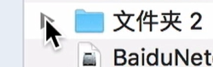

# macOS
## 界面

- 程序坞
    - 退出程序 Command+Q
- 按住command拖拽可以改变状态菜单的位置
- F3 或者 四个指头向上推 打开调度中心
- 文件管理
    - 标记
    - 可以自定义标记快捷键
- 移动时按住option复制
- 按住option
    - 点击通知中心开免打扰
    - 点击WiFi查看ip地址
    - 点击关闭关闭所有窗口
    - option command i 打开检查器
    - 点击打开方式更改默认打开方式、拷贝文件路径
    - 点击三角箭头展开所有目录
        
        
        
        > 商标™：option + 2 （英文模式下）  
        不等号≠：option + ＝  
        注册商标®：option + R  
        圆周率π（大写为∏）：option + P  
        版权©：option + G  
        度°：option + K  
        约等于≈：option + X  
        小于或等于≤：option + ,  
        大于或等于≥：option + .  
        除号÷：option + /  
        美分¢： option + 4 （英文模式下）  
        英镑￡：option + 3  
        欧元€：shift + option + 2  
        > 
        - command 减选
        - 点击文件回车修改文件名
        - command option v 剪切
        - 直接拖拽相当于剪切，跨硬盘拖拽为粘贴（按住option复制）
        - 聚焦搜索
            - 按住command打开路径
            - command b 搜索网页
        - 快捷键
            - 按住control点击左键相当于右键
            - command+~可以在同一程序的不同窗口间切换
            - command option esc 打开任务管理器
            - delete相当于backspace
            - fn+delete 相当于delete
            - command 左键 在新标签页中打开链接
            - 截屏 （**按住control复制到剪贴板）**
                - command shift 3 截全屏
                - command shift 4 截部分（这时按住control也可以复制到剪贴板)
                    - 按空格捕捉窗口（桌面也可以)
                    - 按下空格键前按住option不松可以临时去除截图阴影（适用于排版类）
                - 使用“抓图”可以定时截屏
                    
        预览功能可以修改图片格式
                    
            cmd+shift+6 截取touchbar
                    
        截图屏幕保护的，可以先按住 cmd+shift 不松开点击预览，然后按键盘上的3 也可以截图
                control command d 调出词典
                
                聚焦搜索输入单词后按command L定位到单词查询页面（Big Sur不能用了）