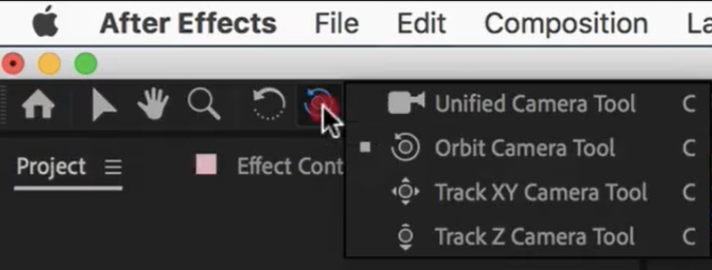
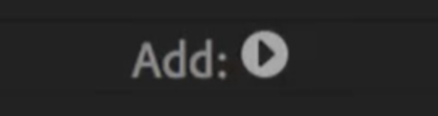
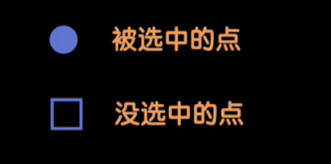
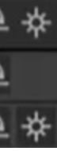
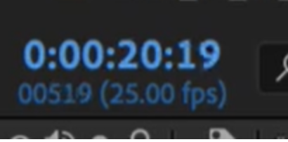

# After Effects

- 快闪
  - 按住眼睛往上拖可以批量打开图层
  - 按住 shift 键可以纯粹平移
- 动效制作
  - U 键显示所有关键帧
  - J 键移动到上一个关键帧
  - K 键移动到下一个关键帧
  - [ 对齐时间条到码表位置
  - **Y 移动中心点**
    - 可以勾选 Snapping（吸附）
    - 按住 ctrl 吸附
  - 鼠标中键抓手
  - 柔和的时候可以在曲线面板里面点击右下按钮
  - Ctrl R 标尺
  - **Ctrl shift c 打组为合成**
  - Ctrl Shift Y 纯色层设置
  - 倒 K 帧可以节省时间
  - 导入 PSD 文件时选择第三项
- 三维空间
  - 基本特性
    - 当三维层属性打开时，不再受层级关系影响，而是受空间关系约束
    - 当三维层打组时，三维层的属性将会消失
  - 颜色（在其他软件中也适用）
  - 查看 3D
    - 建立摄像机
    - 按 C 切换工具（不同属性）
      
    - **标准工具左键移动、右键推拉摇移、中键缩放**
    - 拖拽
  - 背景一般不打开三维层
    - 父子关系 Father 动
      Son 跟着动
      Son 自己动
      Father 不搭理  
      :::info
      子集也在随父集走的时候可以同时拥有自己的动画  
       透明度属性（Opacity）父子关系无作用
      :::
  - 摄像机
    - 一般新建一个空白层，把摄像机设为它的儿子
    - 再对空白层 K 帧，比直接用摄像机 K 帧方便
  - 景深
    - 摄像机属性里
  - 蒙版
    - 什么都不选选择椭圆形工具绘画就是蒙版
    - 叠加使用 Add 可以去除黑色
  - ~：最大化当前区域
- 调色
  - 点击效果控件中的 fx 可以禁用特效，适于做对比
  - 调色前新建 Adjustment Layer （调整图层）
  - 钢笔工具：按住拖拽可以形成曲线，松开完成勾画
  - 双击文本层 Ctrl+V 可以直接添加文字
  - M-遮罩属性
- 歌词字幕
  - 添加动画预设
    - 选择文字
    - 码表放在要添加动画的地方
    - 选择 Animation - Browse Presets
  - 添加动画选择 animate
  - 一般文字动画给 offset （偏移）K 关键帧（既可以反向也可以正向）
    - 动画可以后期添加属性
      
  - 做好一个后
    - Ctrl + D 复制
    - 前括号对齐
    - 双击粘贴
  - 弹幕：日语建议用 MS Mincho 等字体，要直接复制导入 AE 很容易缺字的
    
  - 拆字
    - Ctrl D 复制一层
    - 钢笔工具（G）删除一部分
  - Ramp 渐变命令
- 通道-vlog 花体字
  - 透明通道
  - 进入 alpha 通道显示
  - 亮度通道
    - 黑透白不透（白色的部分显示，黑色的部分透明
    - 适用于 jpg 等不带透明图层的图片，变为黑白关系明显的即可
  - 钢笔工具
    - 如果扣不出来使用钢笔工具
    - 点击拖拽会产生弧形
    - 按住 Alt 拖拽出现滑杆
    - M  蒙版属性可改变混合模式  ( Add Subtract None  等  )
    - 在素材箱里按住 alt 键拖动可以替换
  - 常见黑白水墨素材等使用亮度（反向）即可
  - 裁切素材
    - N 键
    - 右键裁剪到工作区（Trim Comp to work area)
  - Stroke 描边 K 关键帧可以制作字体书写效果
  - 钢笔画完之后 V 键切一下，空白出点一下，再可以切换回钢笔画下一个
  - 高斯模糊可以勾选 Repeat Edge Pixels
  - 小太阳
    
    - 组外继承组内属性
  - Fractal Noise 分形杂波
    - 典型的黑白纹理
- 跟踪
  - 拖动跟踪点的时候注意选择空区域不要选择到 x 或者周边的点
  - 素材要选清晰素材
    - 4k 素材
    - 新建 1080P 序列，将 4k 素材放入再跟踪，可以不那么卡
  - 按 ctrl 切换这里
    
  - Ctrl alt t 时间映射属性 (time remap)
- 抠像
  - 简单抠像使用 Color Key
  - Keying-Key Cleaner（抠像清除器）
  - 如果有一小部分可以通过 Command+D 再画遮罩，必要时可以 K 关键帧
  背景干净单色时
  使用 Color key（颜色键）+抠像清除器缺失部分钢笔简单补充
  背景相近色时
  前景背景对比相差较大
  使用 Color Range
