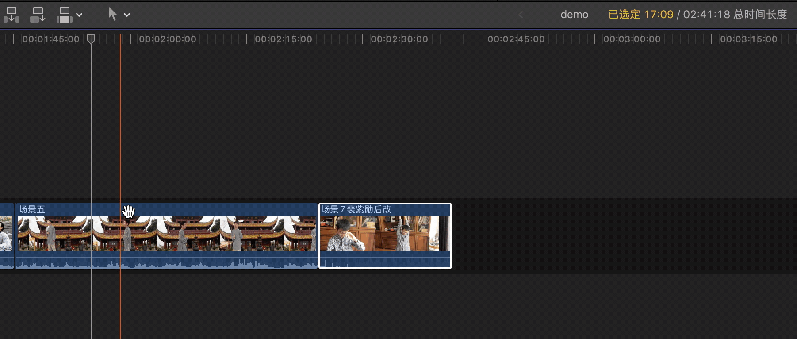
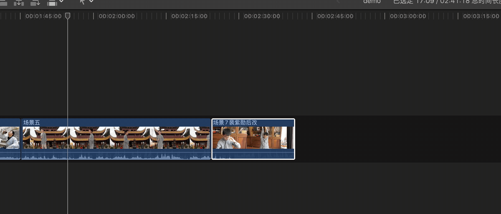
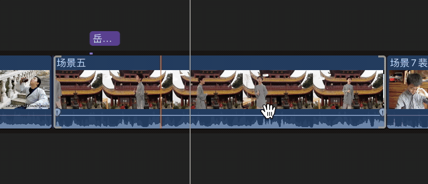
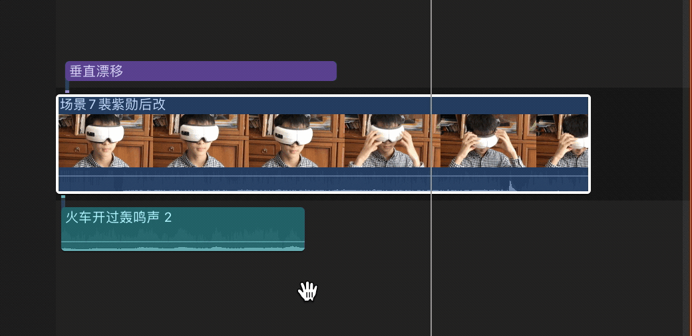
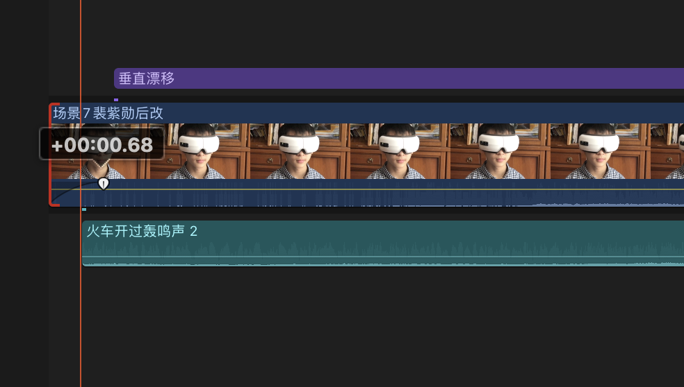

# Final Cut Pro

资源库 相当于文件夹

事件 工程 可以放片段和项目

项目 时间线相当于序列

导入素材的时候如果已经在文件夹分好类了可以选择导入标记

IO 选取入点出点，E 插入到后方

JKL 控制素材选择区播放

添加字幕

将播放头移动到要添加字幕的位置

按 Q

若已经确定好字幕的长短，先使用 R 框选片段再按 Q

字幕自动添加到时间线的上方，播放头的左边（Shift+Q 右边）

双击监视器修改文字，按回车换行，Command+回车 退出编辑状态

- Control + T 添加基本字幕

W 中间插入（总长度增加）

D 覆盖（总长度不变）

T 滚动修剪

B (Blade) 剃刀工具 A 切换回选择 相当于 Pr 的 CV，Fcpx 是 BA

切割时按住 B 不放，切割完后再松开 B，会自动切换回选择工具

⌘+B 直接切割

按住范围选择工具 R 选择后 ⌦

定位到切割点，Option+[可以删除（相当于 Pr 的 Q、W）

选中片段边缘后，在英文输入法下按住逗号和句号也可以伸缩片段（按住 ⇧ 可以加速）

⌥⌘⌫ 在删除主时间线的同时保留 B-roll、音频等

Command R 调整速度

Shift B 分区调整速度

Shift Z 缩放至显示时间线

M 添加标记（例如根据音乐的节拍）

检查是否误触：N 吸附 S 实时预览播放头开关

音频两端的控制点向内拖动可以渐弱

选择整个时间线 control+/ control- 精确调节音量大小

保证综合音量在-6 ～ 0 之间

添加效果时直接双击就可以添加

添加转场

双击自动添加两侧转场

先选中片段一侧，双击添加单侧转场

command+T 添加交叉淡化

Option+F 添加静帧

Option S 独奏

按下 V 停用片段

按住 command 点击后台窗口不会使前台窗口隐藏

如果拖不进去素材，就是左侧选到资源库上了，要选择事件

⌥ X 取消选择

按住 ⌥ 拖拽 复制+定位

复合片段如果直接复制改后面的会影响前面的

在**媒体浏览器**里面 ⌘D 复制片段就可以

⇧H 添加静帧

在 B-roll 添加故事情节可以有磁力吸附效果，移动时点击上面的横条

粘贴为连接片段（⌥V）可以粘贴到 B-roll

⌥W 添加空隙

⌃D 输入 1，可以锁定住音乐

变速时可以选择从故事情节提取
